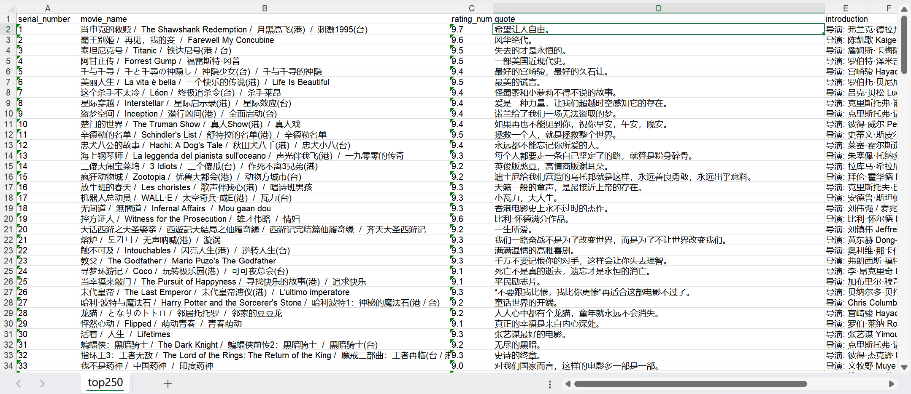

# Douban-top250-scraper
这是一个基于 Scrapy 框架的简单爬虫项目，用于抓取豆瓣电影 Top250 的电影信息。

项目可以获取每部电影的详细信息，包括标题、评分、简介、导演、演员等数据。


安装运行
```bash
pip install -r requirements.txt
python main.py
```

## 项目说明
- 使用Scrapy抓取豆瓣Top250电影
- 结果自动保存为top250.csv
- 包含字段：排名、标题、评分、导演、年份、短评

## 文件说明
- main.py        # 启动脚本
- douban_spider/ # Scrapy项目
- top250.csv     # 爬取结果(运行后生成)

## 注意事项

请勿频繁请求，建议设置 DOWNLOAD_DELAY

本爬虫仅用于学习用途

### 示例截图
